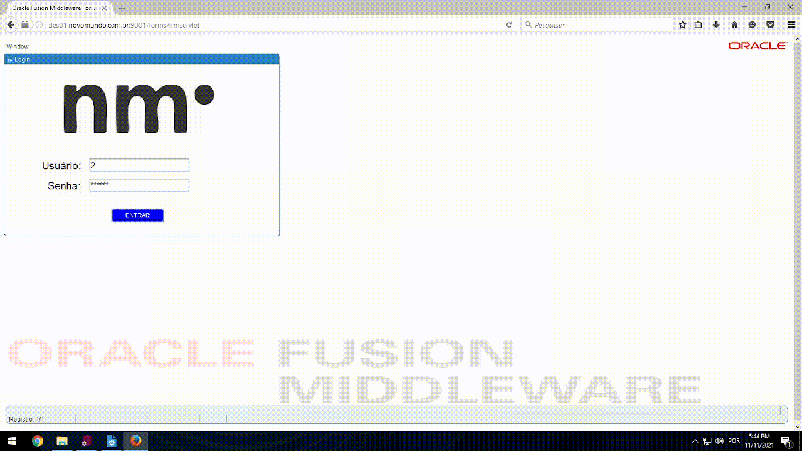

# Desafio TI - Novo Mundo

Ao entrar no projeto Academia de TI da Novo Mundo, realizamos um curso de 200hrs, logo após foi proposto um desafio para criação de um sistema de cadastro de clientes, fornecedores, funcionários, produtos, compra de produtos e venda para o cliente final em Oracle Forms/PL SQL. Aplicando todo o conhecimento adquirido no curso. 

<h1 align="center">Imagens</h1> 

  <h4 align="center">Login</h4> 
  </img> 
  <h4 align="center">Cadastro de Clientes</h4> 
  </img> 
  <h4 align="center">Cadastro de Fornecedores</h4> 
  </img> 
  <h4 align="center">Cadastro de Funcionários</h4> 
  </img> 
  <h4 align="center">Compra de Produtos</h4> 
  </img> 
  <h4 align="center">Venda de Produtos</h4> 
  </img> 

<h1 align="center">Funcionamento</h1> 

  </img> 

## Recursos

- Login
- Cadastro de Clientes
- Cadastro de Funcionários
- Cadastro de Fornecedores
- Cadastro de Produtos
- Compra de produtos direto do Fornecedor, com estoque automatico 
- Venda para o cliente final
- Relatório de todas as vendas e diárias

## Techs

- [Oracle Forms](https://www.oracle.com/br/middleware/technologies/forms/downloads.html) - Oracle Forms é um produto de software para criar telas que interagem com um banco de dados Oracle.
- [PLSQL](https://www.oracle.com/br/database/technologies/xe-downloads.html) - PL/SQL é uma extensão da linguagem padrão SQL para o SGBD Oracle da Oracle Corporation. É uma linguagem procedural da Oracle que estende a linguagem SQL.

## Instalação

Requer [Oracle Database](https://www.oracle.com/br/database/technologies/xe-downloads.html), [Oracle Forms](https://www.oracle.com/br/middleware/technologies/forms/downloads.html) 

